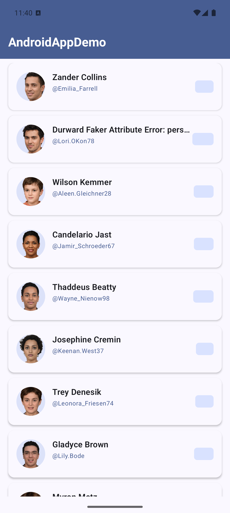
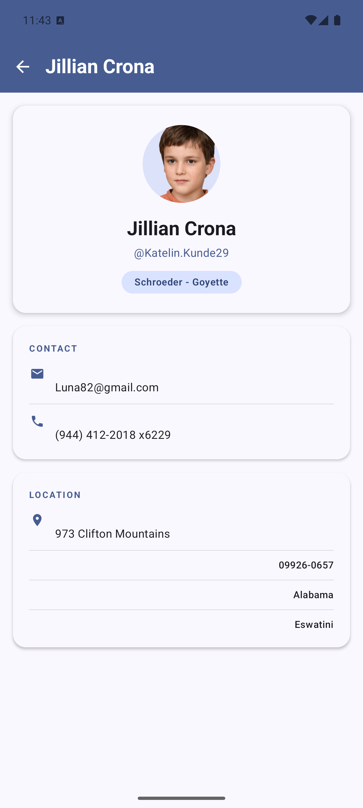

# AndroidDemoCleanArchitecture

A clean Android application that fetches and displays a list of users from a mock REST API, with a detail screen for each user. Built with modern Android development best practices.

---

## 📸 Screenshots & Demo

### User List Screen


### User Detail Screen


### Demo Video


## 🚀 Features

- Fetches a list of users from a live mock REST API
- Displays user list with avatar, name, username, company and country badge
- Tap any user to view full details: contact info, address, ZIP, state and country
- Single API call — list and detail screens share the same ViewModel, so the network is hit only once
- Clean Architecture with separation of data, domain and presentation layers

## 🛠 Technologies Used

| Category | Library / Tool                                                       | Version        |
|---|----------------------------------------------------------------------|----------------|
| Language | Kotlin                                                               | 2.3.21         |
| UI Toolkit | Jetpack Compose + Material 3                                         | BOM 2025.05.00 |
| Architecture | MVVM + Clean Architecture                                            | —              |
| DI | Hilt (Dagger)                                                        | 2.59.2         |
| Networking | Retrofit 2                                                           | 2.11.0         |
| JSON Parsing | Gson (via Retrofit converter)                                        | 2.11.0         |
| HTTP Client | OkHttp 4 + Logging Interceptor                                       | 4.12.0         |
| Image Loading | Coil Compose                                                         | 2.7.0          |
| Navigation | Jetpack Navigation Compose                                           | 2.8.5          |
| ViewModel | Lifecycle ViewModel Compose                                          | 2.8.7          |
| Hilt + Nav | Hilt Navigation Compose                                              | 1.2.0          |
| Async | Kotlin Coroutines + Flow                                             | 1.9.0          |
| Build | Gradle KTS + KSP                                                     | KSP 2.3.9      |
| Min SDK | Android 7.0 (API 24)                                                 | —              |
| Target / Compile SDK | Android (API 37)                                                     | —              |
| API | [Beeceptor Mock API](https://fake-json-api.mock.beeceptor.com/users) | —              |

---

## 🏗 Architecture

The project follows **Clean Architecture**

### Data Flow

```
API → UserDto → (mapper) → User (domain) → Repository → UseCase → ViewModel → UI
```

---

## ⚡ Key Implementation Detail — Single API Call

**User List** screens are powered by a single network request.
**User Details** screens use same userviewmodel as shared viewmodel as getting all details in user list api (Avoiding duplicate calls) 

The detail screen then finds the selected user by ID from the already-loaded list — no second API call is made.

## 🔧 Improvements & Future Scope

| Area | Improvement                                                                                             |
|---|---------------------------------------------------------------------------------------------------------|
| **Caching** | Add a Room database layer so the user list is available offline and on re-launch without a network call |
| **Pagination** | Integrate Paging 3 if the API grows to return paginated results                                         |
| **Search & Filter** | Add a search bar on the user list screen to filter by name, company or country                          |
| **Error Handling** | Distinguish between network errors (no internet) and server errors (4xx / 5xx) with specific messages   |
| **Testing** | Add unit tests for `UserRepositoryImpl` and add more test cases for `UsersViewModel`                                    |
| **UI Tests** | Add Compose UI tests for the list and detail screens using `ComposeTestRule`                            |
| **ProGuard** | Enable `isMinifyEnabled = true` in the release build type and add the appropriate keep rules            |
| **CI/CD** | Add a GitHub Actions workflow to build and run tests on every pull request                              |
| **Deep Links** | Support deep linking directly to a user detail screen via a URI scheme                                  |
| **Accessibility** | Audit and improve content descriptions, font scaling, and touch target sizes                            |

---

## 🏃 How to Run

1. Clone the repository
2. Open in **Android Studio**
3. Let Gradle sync complete
4. Run on an emulator or physical device (API 24+)

No API keys or local configuration are required — the mock API is publicly accessible.


